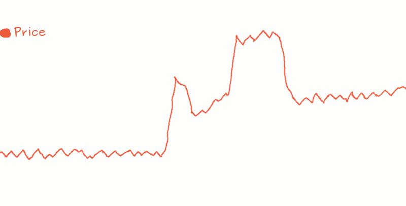
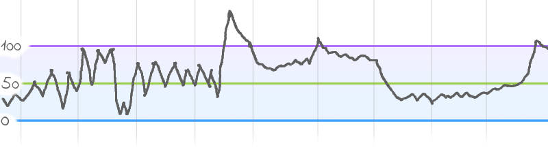
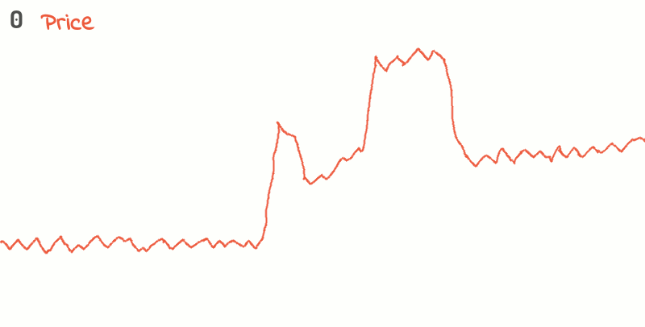
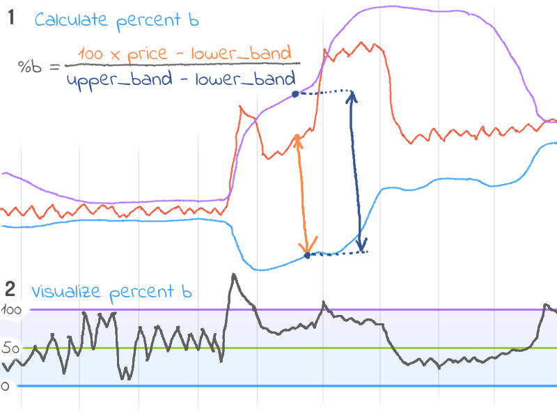

[Notes Home](index.md)

# Bollinger Bands and Percent b (%b)

Bollinger bands are lines that encapsulate the moving average of price data (over N timesteps) at a distance of 2 standard deviations. The absolute distance betweeen the bands narrows or widens depending on the  price volatility. During times of high volatility (within the past N timesteps), the bands are very wide apart. By contrast, during times of stable prices, the bands come closer to each other.




Percent b (%b), is a value that compares the position of the price relative to the upper and lower bollinger bands. So a `%b` value of 0 tells us that the price is touching the lower bollinger band. A value of `50` tells us it is half way between the lower and upper bands. And a value of 100 tells us that the price is touching the upper bollinger band.




It is possible to have `%b` values of greater than 100, and less than 0. And it is when these conditions occur that some investors believe something interesting is about to happen.

## Origins

Bollinger bands were developed and copyrighted by John Bollinger.


## Interpreting

It is believed by some investors that %b provides an indication about a potential change in direction of the prices. The idea is that the majority of price action should occur within the upper and lower bollinger bands. So a %b of greater than 100 means there is an unusual spike in price. This coud be an idication that price will likely go back down. Thus, it is seen as a potential sell signal.

Similarly, a %b lower than 0.0 indicates that there is an unusual dip in the price. Therefore, it is likely that the price will go back up again. Thus, it is seen as a potential buy signal.


## Calculating Bollinger bands

<!-- 1. `midband = moving_avg(price)` -->
1. $\text{midband} = \text{moving_avg(price)}$
    - The `midband` is the moving average of the price. Usually close price is used.
    - Usually the Simple Moving Average (SMA) is used, but you could use something like Exponentially Weighted Moving Average (EMA) instead.
    - For SMA, the usual lookback period is set to 20 timesteps, but you could play around with other values.
<!-- 2. `SD = moving_standard_deviation(price)` -->
2. $\text{SD} = \text{moving_standard_deviation(price)}$
    - Calculate the moving Standard Deviation using the same lookback period.
<!-- 3. `upper_band = midband + (2 * SD)` -->
3. $\text{upper_band} = \text{midband} + (2 \times \text{SD})$
    - The upper band is two standard deviations above the `midband`.
<!-- 4. `lower_band = midband - (2 * SD)` -->
4. $\text{lower_band} = \text{midband} - (2 \times \text{SD})$
    - The lower band is two standard deviations below the `midband`.




## Calculating Percent b (%b)

<!-- `percent_b = (price - lower_band) / (upper_band - lower_band)` -->
- $\text{percent_b} =  100 \times (\text{price} - \text{lower_band}) / (\text{upper_band} - \text{lower_band})$

<!--  -->



## Interpreting

## Python Code


```python
# LIBRARY DEPENDENCIES
import pandas as pd

# DATA AND SETTINGS
x = get_close_price() # Assuming x is a pandas Series of price data
lookback = 20         # lookback period for moving average and std

# CALCULATION
rolling = x.rolling(lookback)
midband = rolling.mean()
std = rolling.std()
lower = midband - (2*std)
upper = midband + (2*std)
percent_b = 100 * (x - lower) / (upper - lower)

bollinger_df = pd.DataFrame(
    dict(bb_midband=midband, bb_lower=lower, bb_upper=upper, bb_percent_b=percent_b)
    )
```


## Using tanpy

```python
# LIBRARY DEPENDENCIES
import tanpy as tp

# DATA AND SETTINGS
x = get_close_price() # Assuming x is a pandas Series of price data

# CALCULATION
bollinger_df = tp.bollinger_bands(x=x, lookback=20)
```
